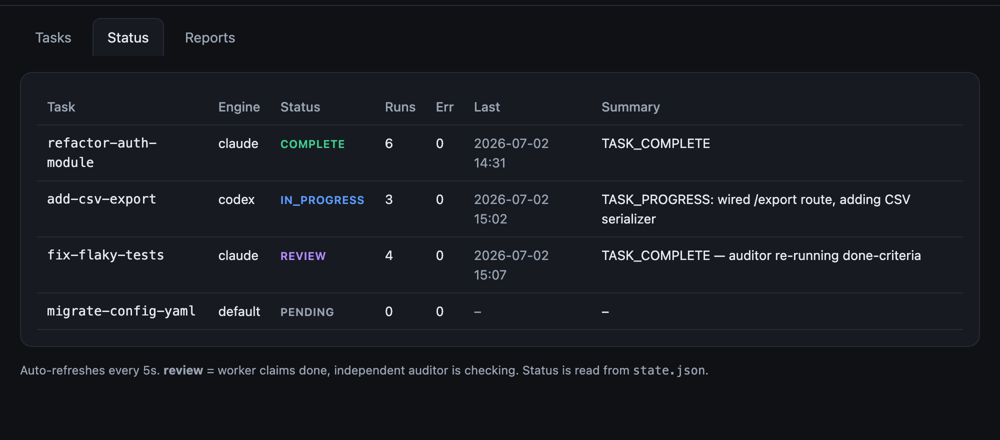
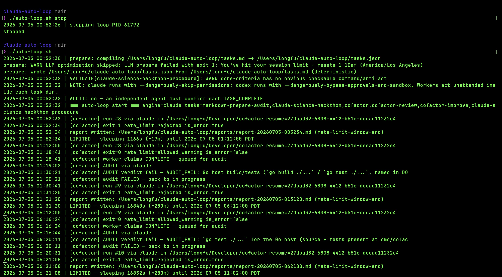
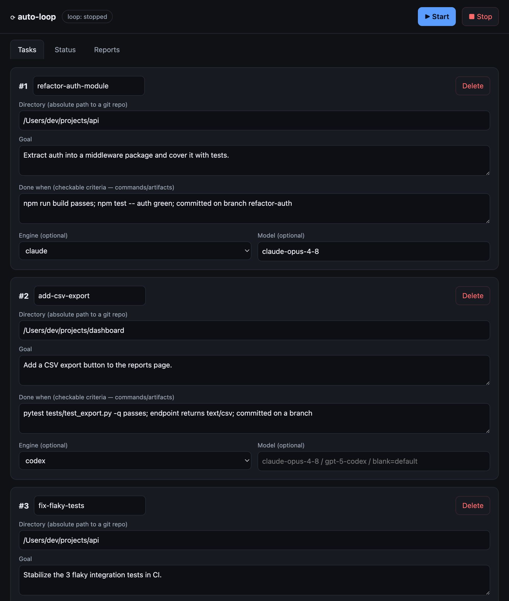
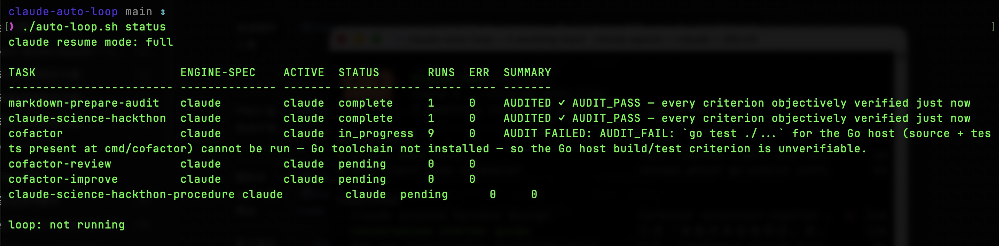

# auto-loop

**English** · [简体中文](README.zh-CN.md)

A small local task queue that keeps coding-agent work moving when one CLI hits a usage limit.

Give it a Markdown backlog. `auto-loop` runs one task at a time with Claude Code or Codex CLI, keeps separate sessions for each engine, switches to a configured fallback engine when the active one is rate-limited, and requires a fresh auditor before a task can be marked complete.

```
tasks.md
   |
   v
Claude Code ---- usage limit ----> Codex
   |                                  |
   +---------- local repo state ------+
                      |
                      v
              independent audit
                      |
                pass / retry
```

## Why I Built It

I wanted to start several coding tasks before leaving my computer and come back to useful progress instead of finding that the queue had stopped at the first usage-limit window.

Three design choices matter:

- **Fail over instead of stall.** A task can continue on Codex when Claude is limited, or vice versa, instead of waiting out the whole reset window.
- **Keep engine context separate.** Claude and Codex maintain independent per-task sessions and resume state, so a resume id never crosses engines.
- **The worker cannot grade itself.** `TASK_COMPLETE` only moves a task to review; a fresh auditor must inspect the repo and verify the `done` criteria before it counts as complete.

Everything runs locally. The core is one readable Bash runner, one stdlib Python UI, and one Markdown-to-JSON task compiler — for people who still want local CLI control instead of handing the whole backlog to a cloud service.

## Quick Start

Requirements: `bash`, `jq`, `git`, `python3`, and at least one logged-in CLI:

- `claude` for Claude Code.
- `codex` for OpenAI Codex CLI.

```bash
git clone https://github.com/longfuxu/auto-loop.git
cd auto-loop
cp tasks.md.example tasks.md
$EDITOR tasks.md
./auto-loop.sh prepare            # AI structures the tasks by default; add TASK_PREPARE_LLM=off for deterministic/offline
./auto-loop.sh validate
./auto-loop.sh run
```

Continue below for the detailed task format, engine fallback, usage reserve, audit, and local UI.

<p align="center">
  
  <br>
  <em>Tasks advance one at a time. A worker can only move a task to review; a separate auditor must verify the done criteria before completion.</em>
</p>

<p align="center">
  
  <br>
  <em>The CLI is the source of truth: foreground or overnight runs write logs, reports, summaries, and task state locally.</em>
</p>

## Task Format

Prefer editing `tasks.md`. `tasks.json` is generated and used by the runner.

```md
## build-settings-panel

dir: /absolute/path/to/a/git/repo

<!--
Engine options:
- engine: claude
- engine: codex

Model examples, passed through to the selected CLI:
- Claude: claude-opus-4-8, claude-opus-4-6, claude-sonnet-4-5
- Codex: gpt-5.5  (ChatGPT-plan accounts reject "-codex"-suffixed names like gpt-5-codex)

Effort examples:
- Claude: low, medium, high, extra, max
- Codex: light, medium, high, extra high

Leave engine/model/effort blank to use the global default/account default.
Use fallback_engine/fallback_model/fallback_effort when you want continuation after a usage limit.
-->
engine: claude
model:
effort:
fallback_engine: codex
fallback_model:
fallback_effort:

goal:
Build the settings panel described in docs/settings-plan.md.

done:
Create and commit the implementation on a feature branch. `npm test` and
`npm run build` pass. Update HANDOFF.md with the changed files and next command.
```

Fields:

- `id`: taken from the `##` heading unless `id:` is provided. Must match `^[a-z0-9-]+$`.
- `dir`: absolute path to a git repo or worktree.
- `goal`: concrete objective.
- `done`: objective verification criteria. Name commands and artifacts.
- `engine`: optional primary engine, `claude` or `codex`. Defaults to `$ENGINE`, then `claude`.
- `model`: optional model for the primary engine. Blank means `$MODEL`, then the account default.
- `effort`: optional reasoning effort for the primary engine. Claude accepts `low`, `medium`, `high`, `extra`, `max`; Codex accepts `light`, `medium`, `high`, `extra high`.
- `fallback_engine`: optional second engine used when the active engine is rate-limited.
- `fallback_model`: optional model for the fallback engine. Blank means `$MODEL`, then the account default.
- `fallback_effort`: optional effort for the fallback engine. Blank means task `effort`, then `$EFFORT`, then the CLI default.

Compile and validate:

```bash
./auto-loop.sh prepare
./auto-loop.sh validate
```

`prepare` parses Markdown deterministically, then — by default (`TASK_PREPARE_LLM=on`) — asks the configured CLI to rewrite each task into a more structured, auditable form: it polishes `goal` and `done` and may set or refine `engine`, `model`, and `effort` (and their `fallback_*` counterparts) to fit the task. The deterministic parser stays the source of truth for **task ids, directories, and task count** — the LLM can never invent a path, rename a task, or add/remove tasks.

Bad or ambiguous `engine`/`model`/`effort` are **repaired, not just rejected**, so a task stays runnable. The LLM maps them to a valid working config (e.g. `engine: gpt-5.5` → `engine: codex`; `effort: very high` → the engine's top tier). It never synthesizes a `-codex`-suffixed model name (e.g. `gpt-5-codex`), which ChatGPT-plan Codex accounts reject; when unsure it leaves the model blank so the CLI uses the account default. A deterministic safety net runs on every path (even `off`): it coerces a recognizable engine (`gpt`/`openai` → codex, `anthropic`/`opus`/`sonnet` → claude), rewrites effort synonyms to a canonical tier, and drops anything it still cannot validate so the runner falls back to its default instead of failing to start.

The AI-written plan is cached in `.tasks.prepare-cache.json`, keyed by a hash of `tasks.md`. As long as you do not change `tasks.md`, re-running `prepare` (or restarting the loop) **reuses that plan without calling the LLM again** — so a task is structured once per edit, not re-planned on every run. This keeps the workflow token-efficient. Edit `tasks.md` to re-plan, pass `--no-cache` to force a refresh, or set `TASK_PREPARE_LLM=off` for deterministic-only output. Override the model with `PREPARE_MODEL`.

## Engine Fallback

Fallback is **bidirectional and cyclic**. When the active engine hits a usage limit:

- Claude: the runner reads `resetsAt` when the CLI exposes it.
- Codex: the runner uses `CODEX_COOLDOWN` because no precise reset epoch is exposed.
- If `fallback_engine` is configured and currently free, the task continues immediately on it instead of sleeping.
- When that engine is later exhausted too, the task switches **back** to the primary if its window has reset; otherwise the loop sleeps until whichever engine resets first. So a long task ping-pongs `claude → codex → claude → …`, always running on whichever engine has quota.
- A **hard error** (not a usage limit) — e.g. a model the account cannot use — also rotates to the other engine for the next run, instead of burning `MAX_ERRORS` on the broken one and parking the task.
- `state.json` stores separate sessions under `sessions.claude` and `sessions.codex`.
- The fallback run receives the local task summary and must inspect the repo state before continuing.

Example:

```md
engine: claude
model: claude-opus-4-8
effort: extra
fallback_engine: codex
fallback_model: gpt-5.5
fallback_effort: high
```

This means: start with Claude, use that model and effort if available, and continue with Codex if Claude is limited (and back to Claude once its window resets).

**Model note:** on a ChatGPT-plan Codex account, use plain model names like `gpt-5.5`. The `-codex`-suffixed names (`gpt-5-codex`, `gpt-5.5-codex`) are rejected with `400 invalid_request_error` and are a common cause of a fallback that "can't start". Leave `fallback_model` blank to inherit the account default.

**Opting out:** set `ENGINE_FALLBACK=0` to pin every task to its primary engine — the loop then waits out the primary's usage window instead of switching. Per task, simply omit `fallback_engine` to disable fallback for that task only.

## Usage Reserve

By default, the loop treats 90% utilization as a soft limit:

```bash
USAGE_LIMIT_THRESHOLD=0.90 ./auto-loop.sh run
```

When the active CLI exposes utilization and reaches this threshold, the current result is still saved, then that engine is marked limited. If a fallback engine is configured, the task continues there. Otherwise the loop sleeps until the reset window. This keeps roughly 10% of the usage window available for normal manual work.

## Summary Resume

Claude can resume the same non-interactive session with `--resume`. Long sessions can become expensive in context, and a session id can expire while the loop sleeps out a multi-hour usage window. `auto-loop` adds harness-level summary resume, and it is now the **default**:

```bash
# default behavior — no flag needed
./auto-loop.sh run
# force a different mode
CLAUDE_RESUME_MODE=full ./auto-loop.sh run
```

Modes:

- `summary` (**default**): use normal `--resume` while a run streams, but after a Claude usage-limit window, start the next Claude run fresh from `summaries/<task>.md` instead of resuming a possibly-stale session id.
- `full`: keep using the stored session id across everything.
- `fresh`: always start from the local summary when one exists.

The summary file contains task goal, done criteria, last result, active engine, sessions by engine, and recent commits.

## Independent Audit

When a worker prints `TASK_COMPLETE`, the task moves to `review`, not `complete`.

The auditor is a fresh CLI run with a different prompt. It must inspect the repo, run the commands named in `done`, and answer:

- `AUDIT_PASS`
- `AUDIT_FAIL: <reason>`

Only `AUDIT_PASS` marks the task complete. Disable with `AUDIT=0` only when you are deliberately accepting self-attested completion.

## Local UI

```bash
./auto-loop.sh ui 8787
```

The UI binds to `127.0.0.1`, edits tasks, validates them through the CLI, starts/stops the loop, and reads reports. It is a local admin panel; do not expose it to a network.

<p align="center">
  
  <br>
  <em>The UI supports primary engine/model/effort plus fallback engine/model/effort.</em>
</p>

<p align="center">
  
  <br>
  <em>Terminal status is compact enough for SSH, tmux, or a morning check after an overnight run.</em>
</p>

## Commands

```bash
./auto-loop.sh run          # foreground run
./auto-loop.sh prepare      # tasks.md -> tasks.json
./auto-loop.sh doctor       # preview prepared JSON without writing
./auto-loop.sh validate     # validate tasks, preparing first if needed
./auto-loop.sh edit         # edit tasks.md or tasks.json, then validate
./auto-loop.sh status       # task status, engine spec, active engine
./auto-loop.sh sessions     # per-task sessions by engine
./auto-loop.sh attach <id>  # interactive pickup on the active engine session
./auto-loop.sh report       # write reports/report-<ts>.md
./auto-loop.sh stop         # stop the lock-file PID
```

Useful environment variables:

```bash
ENGINE=claude              # default primary engine when a task omits engine
ENGINE_FALLBACK=1          # 1 = rotate to the fallback engine (both ways); 0 = primary only
MODEL=                     # default model when a task omits model
EFFORT=                    # default effort when a task omits effort
USAGE_LIMIT_THRESHOLD=0.90 # reserve usage headroom when utilization is exposed
CLAUDE_RESUME_MODE=summary # full | summary | fresh (default: summary)
CODEX_COOLDOWN=3600        # fallback wait for Codex usage limits
AUDIT=1                    # require independent audit
AUDIT_ENGINE=              # override auditor engine
AUDIT_MODEL=               # override auditor model
AUDIT_EFFORT=              # override auditor effort
REQUIRE_GIT=1              # task dir must be a git repo
```

## Overnight Mac Runs

To run before sleep while letting the display turn off:

```bash
# Plugged in: prevent system sleep, but allow display sleep.
caffeinate -s ./auto-loop.sh run

# Battery: prevent idle sleep, but expect battery drain.
caffeinate -i ./auto-loop.sh run
```

Then turn the display off from another terminal:

```bash
pmset displaysleepnow
```

Notes:

- Do not use `caffeinate -d`; it intentionally keeps the display awake.
- Do not close the laptop lid unless you have a working clamshell setup; closing the lid normally sleeps the Mac.
- Check active sleep assertions with `pmset -g assertions`.
- In the morning, run `./auto-loop.sh status` and inspect `reports/`.

## Positioning

`auto-loop` is not trying to be the biggest agent platform. Its edge is the narrow local workflow:

| Type | Representative examples | How they work | auto-loop difference |
|---|---|---|---|
| Task queue / rate-limit loop | `claude-queue`, queue-style runners | Python workers, priorities/dependencies, plan-limit monitoring, pause near quota | More focused on Claude+Codex dual engine, per-task sessions, and independent audit |
| Continuous loop tool | `Ralph` | Repeatedly calls coding agents with exit signals, circuit breakers, resume, logs | Do not compete on "infinite loop"; position as task list + quota sleep/fallback + audit |
| PR/CI workflow | `Continuous Claude`-style tools | Shared notes, PR creation, CI waiting, merge flow | Lighter, local-first, better for a personal backlog before PR machinery |
| Graphical command center | CloudCLI, Codexia, async-code-style tools | Web/mobile/desktop control, sessions, parallel tasks, worktrees, remote control | Smaller and more readable: Bash runner plus local stdlib UI |
| Official async agents | Claude Code on web, Claude routines, OpenAI Codex | Cloud sandbox, GitHub repo access, automatic PRs, parallel tasks | For users who still want local Claude Code/Codex CLI control and local files |
| Safety/guardrail layer | CC Safety Net-style tools | Hooks block dangerous commands | Complementary; auto-loop's guardrails are prompt-level plus audit, not an OS sandbox |

## Safety

This tool runs unattended with skipped approvals:

- Claude: `--dangerously-skip-permissions`
- Codex: `--dangerously-bypass-approvals-and-sandbox`

Use it only for repos where that is acceptable.

Guardrails:

- The worker prompt says to edit only inside the task `dir`.
- The worker must commit on a feature branch.
- The worker must not touch `main`/`master`, merge, force-push, or print secrets.
- Startup validation rejects malformed tasks and non-git dirs unless `REQUIRE_GIT=0`.
- A PID lock prevents two loops from running the same queue.
- Credentials should live in the environment, never in task files, logs, reports, or handoff docs.

Honest limitation: prompt-level rules are not a sandbox. A misbehaving or prompt-injected run can still execute local commands with the permissions you gave it. Keep backups, use disposable branches, and write concrete `done` checks.

## Files

```
auto-loop.sh              # runner: engines, fallback, sessions, audit, reports
scripts/prepare_tasks.py  # tasks.md -> tasks.json compiler
ui-server.py              # dependency-free local UI backend
ui.html                   # local UI
tasks.md.example          # human-friendly task template
tasks.example.json        # JSON schema example
tasks.md                  # local task source, git-ignored
tasks.json                # generated task list, git-ignored
state.json                # runtime state, git-ignored
logs/                     # transcripts and main log, git-ignored
reports/                  # markdown reports, git-ignored
summaries/                # context summaries, git-ignored
```

## License

Apache-2.0. See `LICENSE` and `NOTICE`.
